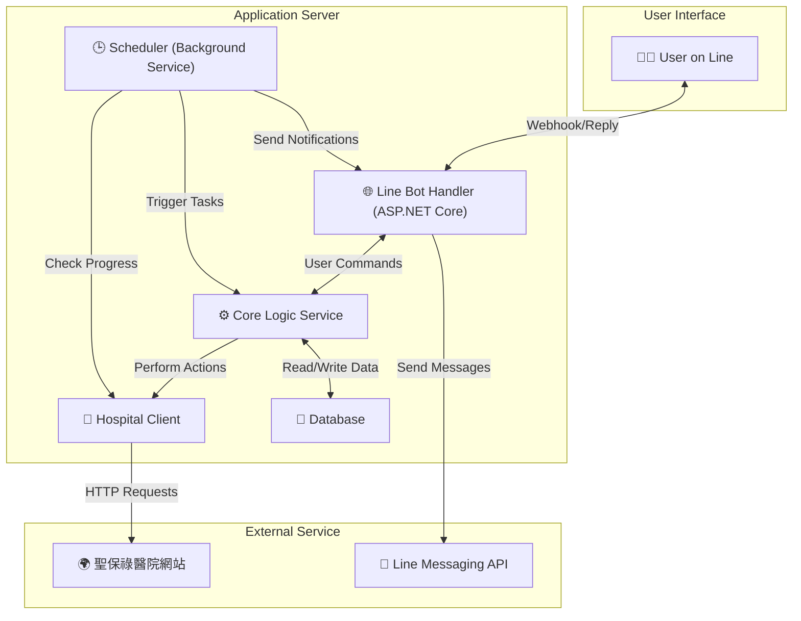

# SPHAssistant (聖保祿醫院掛號小幫手)


這是一個針對桃園聖保祿醫院 (St. Paul's Hospital) 設計的自動化掛號與門診查詢輔助工具。此專案旨在透過背景服務與 Line Bot 整合，簡化預約掛號、查詢門診進度與接收通知的流程。

## ✨ 核心功能

* **🤖 自動掛號**：根據設定的醫生、科別與時段，在掛號開放時自動完成預約。
* **🔔 門診進度監控與通知**：定時監控目前看診號碼，並在接近時透過 Line 發送通知。
* **🔍 門診資訊查詢**：可透過 Line Bot 查詢特定科別的醫生、可預約時段等資訊。
* **📅 掛號管理**：提供查詢已掛號紀錄與取消掛號的功能。

## 🛠️ 技術棧 (Tech Stack)

* **後端框架**: .NET 8 (ASP.NET Core for Web API)
* **通訊介面**: Line Messaging API
* **網頁互動**: `HttpClient` (用於 API 請求), `AngleSharp` / `HtmlAgilityPack` (用於 HTML 解析)
* **影像辨識 (OCR)**: `Tesseract` + `OpenCvSharp` + `SixLabors.ImageSharp` (用於解析驗證碼)
* **日誌記錄 (Logging)**: `Serilog` (結構化日誌框架)
* **資料庫**: 關聯式資料庫 (待定)
* **背景任務**: `Hangfire` 或 .NET 內建的 `BackgroundService`

## 🏗️ 系統架構規劃

本專案採用模組化設計，將不同職責的功能切分，以利於開發與維護。



* **Line Bot Handler**：接收 Line Webhook，解析使用者指令，並回傳格式化訊息。
* **Core Logic Service**：核心商業邏輯，協調各模組完成使用者請求。
* **Hospital Client**：封裝所有與醫院網站的互動，包含爬取資料、模擬掛號、解析驗證碼等。
* **Scheduler**：執行定時背景任務，如監控門診進度、觸發自動掛號。
* **Database**：儲存使用者資料、掛號紀錄與設定。

---

## 🗺️ 開發藍圖與進度 (Development Roadmap & Progress)

此處使用簡單的表格來追蹤各主要功能的開發進度。

| 階段 (Phase) | 主要功能 (Major Feature) | 狀態 (Status) | 預計完成日 | 備註 |
| :--- | :--- | :---: | :---: | :--- |
| **P1: 核心功能建立** | **1.1** 醫院網站 Client 開發 (查詢門診/醫生) | ⚪️ 未開始 | - | |
| | **1.2** 驗證碼 OCR 辨識模組 | 🟡 進行中 | - | |
| | **1.3** 模擬登入與掛號功能 | ⚪️ 未開始 | - | |
| | **1.4** 門診進度爬蟲 | ⚪️ 未開始 | - | |
| **P2: Line Bot 整合**| **2.1** 建立 Line Bot Webhook 伺服器 | ⚪️ 未開始 | - | |
| | **2.2** 實作查詢指令 (查詢醫生/門診) | ⚪️ 未開始 | - | |
| | **2.3** 實作掛號指令 | ⚪️ 未開始 | - | |
| | **2.4** 實作查詢/取消掛號指令 | ⚪️ 未開始 | - | |
| **P3: 背景服務** | **3.1** 資料庫 Schema 設計與建立 | ⚪️ 未開始 | - | |
| | **3.2** 門診進度監控背景服務 | ⚪️ 未開始 | - | |
| | **3.3** Line 推播通知功能 | ⚪️ 未開始 | - | |
| | **3.4** 自動掛號排程服務 | ⚪️ 未開始 | - | |
| **P4: 優化與部署** | **4.1** 錯誤處理與日誌記錄 | ✅ 已完成 | - | |
| | **4.2** 撰寫單元測試 | ⚪️ 未開始 | - | |
| | **4.3** Docker 容器化 | ⚪️ 未開始 | - | |
| | **4.4** 部署至雲端平台 | ⚪️ 未開始 | - | |

**狀態圖例:**
* ⚪️ 未開始 (Not Started)
* 🟡 進行中 (In Progress)
* ✅ 已完成 (Completed)

---

## 🚀 如何開始 (Getting Started)

1.  Clone 此專案儲存庫：
    ```bash
    git clone [https://github.com/your-username/SPHAssistant.git](https://github.com/your-username/SPHAssistant.git)
    cd SPHAssistant
    ```
2.  安裝 .NET 8 SDK。
3.  還原專案相依套件：
    ```bash
    dotnet restore
    ```
4.  設定環境變數（詳細內容待開發階段定義）。
5.  執行專案：
    ```bash
    dotnet run
    ```

## ⚙️ 環境設定

本專案將使用 `.NET` 的 `appsettings.json` 檔案來管理設定。隨著開發的進行，所需的設定鍵值將會在此處更新。

一個基本的設定檔範本 (`appsettings.Development.json`) 可能會包含以下內容：

```json
{
  "LineBot": {
    "ChannelSecret": "YOUR_CHANNEL_SECRET",
    "ChannelAccessToken": "YOUR_CHANNEL_ACCESS_TOKEN"
  }
}
```
> **注意**：包含敏感資訊的 `appsettings.*.json` 檔案應加入 `.gitignore` 中，避免上傳至版本控制系統。

## ⚠️ 重要聲明 (Disclaimer)

* 本專案僅為個人技術研究與學習之用，請勿用於任何商業或非法用途。
* 自動化程式可能違反醫院網站的服務條款。使用者需自行承擔所有風險，開發者不負任何法律責任。
* 若醫院網站進行改版，本專案的功能可能會失效，需要手動更新程式碼以進行適配。

## 📄 授權 (License)

本專案採用 [MIT License](LICENSE) 授權。