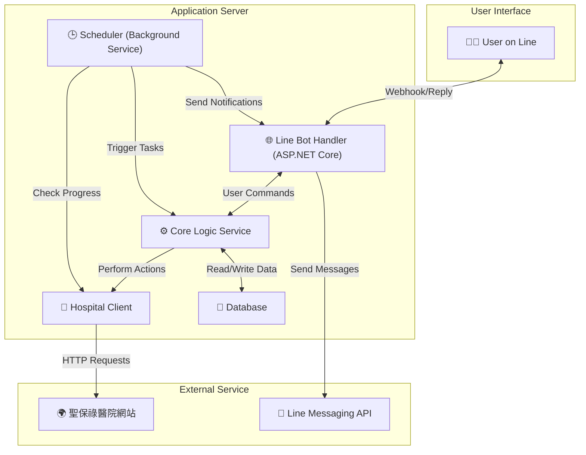

# SPHAssistant (聖保祿醫院掛號小幫手)


這是一個針對桃園聖保祿醫院 (St. Paul's Hospital) 設計的自動化掛號與門診查詢輔助工具。此專案旨在透過背景服務與 Line Bot 整合，簡化預約掛號、查詢門診進度與接收通知的流程。

## ✨ 核心功能

* **🤖 自動掛號**：根據設定的醫生、科別與時段，在掛號開放時自動完成預約。
* **🔔 門診進度監控與通知**：定時監控目前看診號碼，並在接近時透過 Line 發送通知。
* **🔍 門診資訊查詢**：可透過 Line Bot 查詢特定科別的醫生、可預約時段等資訊。
* **📅 掛號管理**：提供查詢已掛號紀錄與取消掛號的功能。
* **🐳 Docker 支援**：提供 Dockerized 開發環境，簡化本機測試與未來部署流程。

## 🛠️ 技術棧 (Tech Stack)

* **後端框架**: .NET 9 (ASP.NET Core for Web API)
* **通訊介面**: Line Messaging API
* **網頁互動**: `HttpClient` (用於 API 請求), `HtmlAgilityPack` (用於 HTML 解析)
* **影像辨識 (OCR)**: `Tesseract` + `OpenCvSharp` + `SixLabors.ImageSharp` (用於解析驗證碼)
* **日誌記錄 (Logging)**: `Serilog` (結構化日誌框架)
* **資料庫**: 關聯式資料庫 (待定)
* **背景任務**: `Hangfire` 或 .NET 內建的 `BackgroundService`

## 🏗️ 系統架構規劃

本專案採用模組化的 Monorepo (單一程式碼庫) 架構，將不同職責的服務明確地劃分在獨立的目錄中，以提高內聚性、降低耦合度，並簡化獨立開發與部署的流程。

### 目錄結構 (Directory Structure)

```
/SPHAssistant/ (Git Repo Root)
├── .env.example
├── docker-compose.yml         <-- 啟動所有服務
├── SPHAssistant.sln           <-- 包含所有專案，用於整合開發
├── SPHAssistant.Line.sln      <-- 只包含 Line 相關專案
├── SPHAssistant.Worker.sln    <-- 只包含 Worker 相關專案
├── README.md
│
├── src/
│   ├── SPHAssistant.Core/     <-- 共用核心商業邏輯
│   │
│   ├── Line/                  <-- Line 服務的邏輯邊界
│   │   ├── Dockerfile         <-- Line 服務專用的 Dockerfile
│   │   ├── SPHAssistant.Line.Core/
│   │   └── SPHAssistant.Line.Webhook/
│   │
│   └── Worker/                <-- Worker 服務的邏輯邊界
│       ├── Dockerfile         <-- (規劃中) Worker 服務專用的 Dockerfile
│       └── SPHAssistant.Worker/
│
├── devops/                    <-- (規劃中) CI/CD 相關腳本
├── docs/                      <-- (規劃中) 專案文件
├── tools/                     <-- (規劃中) 開發用工具或腳本
└── tests/                     <-- (規劃中) 所有測試專案 (單元測試、整合測試)
```

### 服務關係圖 (Service Diagram)



* **Line Bot Handler**：接收 Line Webhook，解析使用者指令，並回傳格式化訊息。
* **Core Logic Service**：核心商業邏輯，協調各模組完成使用者請求。
* **Hospital Client**：封裝所有與醫院網站的互動，包含爬取資料、模擬掛號、解析驗證碼等。
* **Scheduler**：執行定時背景任務，如監控門診進度、觸發自動掛號。
* **Database**：儲存使用者資料、掛號紀錄與設定。

---

## 🔬 網站互動原理 (Site Interaction Principles)

本專案透過模擬一般使用者在瀏覽器上的操作，以非瀏覽器 (nobrowser) 的方式與聖保祿醫院的掛號網站進行互動。該網站是使用 **ASP.NET Web Forms** 技術建置，其核心機制為 **PostBack**。

### Web Forms PostBack 機制解析

1.  **初始載入 (Initial GET Request)**:
    *   當程式首次對目標頁面 (如 `Query.aspx`) 發送 `GET` 請求時，伺服器會回傳完整的 HTML。
    *   此 HTML 內包含了數個重要的隱藏欄位 (`<input type="hidden">`)，其中最關鍵的是 `__VIEWSTATE`。此欄位以 Base64 編碼儲存了頁面上所有控制項的狀態。

2.  **維持會話 (Session Management)**:
    *   ASP.NET 網站透過 `ASP.NET_SessionId` 這個 Cookie 來識別不同的使用者會話。驗證碼的正確值被儲存在伺服器的 Session 中。
    *   因此，從初始載入、獲取驗證碼，到最終提交表單，**全程都必須使用同一個 `HttpClient` 實例**，並透過 `CookieContainer` 來自動管理和傳遞此 Session Cookie。

3.  **提交表單 (Form POST Request)**:
    *   當使用者在網頁上點擊按鈕（例如「送出查詢」）時，瀏覽器會向**同一個頁面**發起一個 `POST` 請求，此行為稱為 PostBack。
    *   這個 `POST` 請求的內容 (Payload) 必須包含：
        *   所有使用者填寫的資料（如身分證號、生日）。
        *   從初始 `GET` 請求中取得的所有隱藏欄位 (`__VIEWSTATE`, `__EVENTVALIDATION` 等)。
        *   觸發此次提交的按鈕的 `name` 與 `value`。

### C# 實作流程

`HospitalClient` 服務完整封裝了上述流程：

1.  **建立 `HttpClient`**: 建立一個包含 `CookieContainer` 的 `HttpClient` 實例，並設定模擬瀏覽器的 `User-Agent`。
2.  **發送初始 GET 請求**: 呼叫目標頁面，取得 HTML 內容及 `ASP.NET_SessionId` Cookie。
3.  **解析隱藏欄位**: 使用 `HtmlAgilityPack` 解析 HTML，提取 `__VIEWSTATE`, `__VIEWSTATEGENERATOR`, `__EVENTVALIDATION` 的值。
4.  **下載並辨識驗證碼**: 在同一個 `HttpClient` 會話下，請求驗證碼圖片 URL (`ValidateCode.aspx`)，並將回傳的圖片資料流交給 `OcrService` 進行辨識。
5.  **建構並發送 POST 請求**: 將所有使用者資料、隱藏欄位和驗證碼組合成 `FormUrlEncodedContent`，向目標頁面發送 `POST` 請求。
6.  **分析回應**: 根據回傳的 HTML 內容，判斷操作是否成功（例如，檢查是否包含 "驗證碼錯誤" 或 "查無資料" 等關鍵字）。

透過精確模擬這個流程，我們的程式得以在沒有圖形介面的情況下，完成與 Web Forms 網站的資料互動。

---

## 🏥 醫院科別代碼 (Department Codes)

以下為本專案爬取門診時刻表所需使用的科別 (`dpt`) 代碼清單。

| 大類 | 科別 | dpt 數值 |
| :--- | :--- | :--- |
| **內科** | 一般內科 | `S1100A` |
| | 腎臟科 | `S1500A` |
| | 新陳代謝科 | `S1600A` |
| | 胸腔內科 | `S1300A` |
| | 職業病門診 | `S1100D` |
| | 家庭醫學科 | `S3H00A` |
| | 心臟內科 | `S1700A` |
| | 風濕免疫過敏科 | `S1800A` |
| | 神經內科 | `S3700A` |
| | 感染科 | `S1A00A` |
| | 肉毒桿菌素注射特別門診 | `S3700C` |
| | 腸胃肝膽科 | `S1200A` |
| | 周邊血管門診 | `S1700C` |
| | 腫瘤內科 | `S1400A` |
| | 多重慢性併整合門診 | `S1700ZS1800ZS1600ZS3700Z` |
| | 戒菸門診 | `S1700ES1300ES3H00E` |
| | COVID-19自費採檢 | `S0990G` |
| **外科** | 一般外科 | `S2100A` |
| | 腦神經脊椎外科 | `S2300A` |
| | 整形外科 | `S2500A` |
| | 泌尿外科 | `S2600A` |
| | 骨科 | `S2700A` |
| | 下背痛門診 | `S2300CS2700C` |
| | 運動傷害門診 | `S2700D` |
| | 周邊血管門診 | `S2200B` |
| | 胸腔暨心臟血管外科 | `S2200A` |
| | 骨質疏鬆門診 | `S2700JS3H00JS2300J` |
| **牙科** | 一般牙科 | `SD000ASD140B` |
| **婦產科/女性門診** | 婦產科 | `S7000A` |
| **兒童專科** | 兒科 | `S3200A` |
| | 健兒門診 | `S3210A` |
| | 兒童發展篩檢門診 | `S3200K` |
| **其他專科** | 眼科 | `S3400A` |
| | 耳鼻喉科 | `S3500A` |
| | 營養諮詢門診 | `S3K00A` |
| | 皮膚科 | `S3800A` |
| | 復健科 | `S3900A` |
| | 健康檢查科 | `S1950A` |
| | 精神科(限十八歲以上者) | `S3600A` |
| | 兒童青少年心智健康門診 | `S3600B` |
| | 健康減重門診 | `S3H00V` |

---

## 🗺️ 開發藍圖與進度 (Development Roadmap & Progress)

此處使用簡單的表格來追蹤各主要功能的開發進度。

| 階段 (Phase) | 主要功能 (Major Feature) | 狀態 (Status) | 預計完成日 | 備註 |
| :--- | :--- | :---: | :---: | :--- |
| **P1: 核心功能建立** | **1.1** 醫院網站 Client 開發 (查詢門診/醫生) | ✅ 已完成 | - | |
| | **1.2** 驗證碼 OCR 辨識模組 | ✅ 已完成 | - | |
| | **1.3** 模擬登入與掛號功能 | ✅ 已完成 | - | 服務已建立，細部流程調整中 |
| | **1.3.1** 實作身份驗證流程 (`Login.aspx`) | 🟡 進行中 | - | 因 ASP.NET EventValidation 機制複雜，暫緩實作 |
| | **1.3.2** 實作複診掛號流程 (`Order.aspx`) | 🟡 進行中 | - | 同上 |
| | **1.3.3** 實作初診掛號流程 | ⚪️ 未開始 | - | |
| | **1.4** 門診進度爬蟲 | ⚪️ 未開始 | - | |
| | **1.5** 表格產生器模組 | ✅ 已完成 | - | 未來預計再增加 Line 專用格式 |
| **P2: Line Bot 整合**| **2.1** 建立 Line Bot Webhook 伺服器 | ⚪️ 未開始 | - | |
| | **2.2** 實作查詢指令 (查詢醫生/門診) | ⚪️ 未開始 | - | |
| | **2.3** 實作掛號指令 | ⚪️ 未開始 | - | |
| | **2.4** 實作查詢/取消掛號指令 | ⚪️ 未開始 | - | |
| **P3: 背景服務** | **3.1** 資料庫 Schema 設計與建立 | ⚪️ 未開始 | - | |
| | **3.2** 門診進度監控背景服務 | ⚪️ 未開始 | - | |
| | **3.3** Line 推播通知功能 | ⚪️ 未開始 | - | |
| | **3.4** 自動掛號排程服務 | ⚪️ 未開始 | - | |
| **P4: 優化與部署** | **4.1** 錯誤處理與日誌記錄 | ✅ 已完成 | - | |
| | **4.2** 撰寫單元測試 | ⚪️ 未開始 | - | |
| | **4.3** Docker 容器化 | 🟡 進行中 | - | |
| | **4.3.1** Webhook 服務容器化 | ✅ 已完成 | - | 採用 Monorepo 架構，Context 獨立 |
| | **4.3.2** Worker 服務容器化 | ⚪️ 未開始 | - | |
| | **4.4** 部署至雲端平台 | ⚪️ 未開始 | - | |

**狀態圖例:**
* ⚪️ 未開始 (Not Started)
* 🟡 進行中 (In Progress)
* ✅ 已完成 (Completed)

---

## 🚀 如何開始 (Getting Started)

### 本機直接執行 (不使用 Docker)

1.  Clone 此專案儲存庫。
2.  安裝 .NET 9 SDK。
3.  還原專案相依套件：
    ```bash
    dotnet restore
    ```
4.  設定環境變數（詳細內容待開發階段定義）。
5.  執行專案 (可選擇執行完整的 `SPHAssistant.sln` 或特定服務的 `.sln`)：
    ```bash
    # 執行 Webhook 服務
    dotnet run --project src/Line/SPHAssistant.Line.Webhook/SPHAssistant.Line.Webhook.csproj
    ```

### Docker 化開發

此為測試 Line Bot Webhook 的建議方式。專案採用 Monorepo 架構，將 Line 服務的建置上下文 (Build Context) 獨立在其 `src/Line` 目錄下，實現了清晰的關注點分離。

#### 1. 使用 Docker Compose (推薦)

此方法會自動啟動 Webhook 服務與 ngrok 穿透服務。

1.  **安裝 Docker 與 Docker Compose**。
2.  **建立 `.env` 檔案**：
    *   在專案根目錄下，將 `.env.example` 檔案複製一份並改名為 `.env`。
    *   打開 `.env` 檔案，填入 `NGROK_AUTHTOKEN`, `LINE_CHANNEL_SECRET`, 和 `LINE_CHANNEL_ACCESS_TOKEN`。
3.  **啟動服務**：在專案根目錄下執行：
    ```bash
    docker-compose up --build
    ```
4.  **取得 Webhook URL**：
    *   觀察 ngrok 服務日誌，找到 `url=https://...` 的一行，此即為公開網址。
    *   或者，在瀏覽器打開 `http://localhost:4040` 查看 ngrok 儀表板。
5.  **設定 Line Developer Console**：
    *   將 ngrok URL 加上路由 `/api/line` (例如: `https://your-ngrok-id.ngrok-free.dev/api/line`)，填入 Line Bot 的 Webhook URL 欄位中並儲存。

#### 2. 手動建置並執行 Docker Image

若需單獨建置某個服務的 Docker Image，可使用以下指令。

*   **建置 Line Webhook 服務**:
    ```bash
    docker build -t sph-assistant-webhook:latest -f src/Line/Dockerfile src/Line
    ```
    *   `-t sph-assistant-webhook:latest`: 為映像檔指定名稱 (tag)。
    *   `-f src/Line/Dockerfile`: 明確指定 `Dockerfile` 的路徑。
    *   `src/Line`: 指定建置上下文 (Build Context)，`Dockerfile` 中的 `COPY` 指令會以此目錄為相對路徑的起點。

*   **執行 Line Webhook 容器**:
    ```bash
    docker run -d -p 8088:8080 --name sph-webhook sph-assistant-webhook:latest
    ```
    *   此指令會在背景執行容器，並將容器的 8080 port 映射到本機的 8088 port。

## ⚙️ 環境設定

本專案使用 `.NET` 的 `appsettings.json` 檔案來管理設定。一個基本的設定檔範本 (`appsettings.Development.json`) 可能會包含以下內容：

```json
{
  "LineBot": {
    "ChannelSecret": "YOUR_CHANNEL_SECRET",
    "ChannelAccessToken": "YOUR_CHANNEL_ACCESS_TOKEN"
  }
}
```
> **注意**：包含敏感資訊的 `appsettings.*.json` 檔案應加入 `.gitignore` 中，避免上傳至版本控制系統。

## 📚 專案結構說明

此 Monorepo 架構具有以下優點：

1.  **清晰的邊界 (Clear Boundaries)**：
    *   `src/Line` 和 `src/Worker` 是獨立的單元。所有與特定服務相關的程式碼和設定（包括 `Dockerfile`）都內聚在各自的目錄下，與其他服務完全解耦。

2.  **優化的 Build Context**：
    *   `docker-compose.yml` 為每個服務指定了獨立的 `build.context` (例如 `context: ./src/Line`)。
    *   這使得 `Dockerfile` 內的路徑可以相對於其邏輯邊界的根目錄撰寫，變得非常直觀。
    *   同時，這也避免了將不相關的檔案（如 Worker 服務的程式碼）傳送給 Docker 引擎，提升了建置效率與安全性。

3.  **獨立的開發體驗 (Independent Dev Experience)**：
    *   透過專用的 `.sln` 檔案，開發者可以只載入其關心的專案，加速 IDE 的啟動並減少認知負擔。

4.  **CI/CD 友善 (CI/CD Friendly)**：
    *   此結構可輕易地設定自動化流程 (CI/CD)，例如：只在 `src/Line` 目錄下的檔案有變動時，才觸發 Line 服務的 Docker 映像檔建置與部署。

## ⚠️ 重要聲明 (Disclaimer)

* 本專案僅為個人技術研究與學習之用，請勿用於任何商業或非法用途。
* 自動化程式可能違反醫院網站的服務條款。使用者需自行承擔所有風險，開發者不負任何法律責任。
* 若醫院網站進行改版，本專案的功能可能會失效，需要手動更新程式碼以進行適配。

## 📄 授權 (License)

本專案採用 [MIT License](LICENSE) 授權。